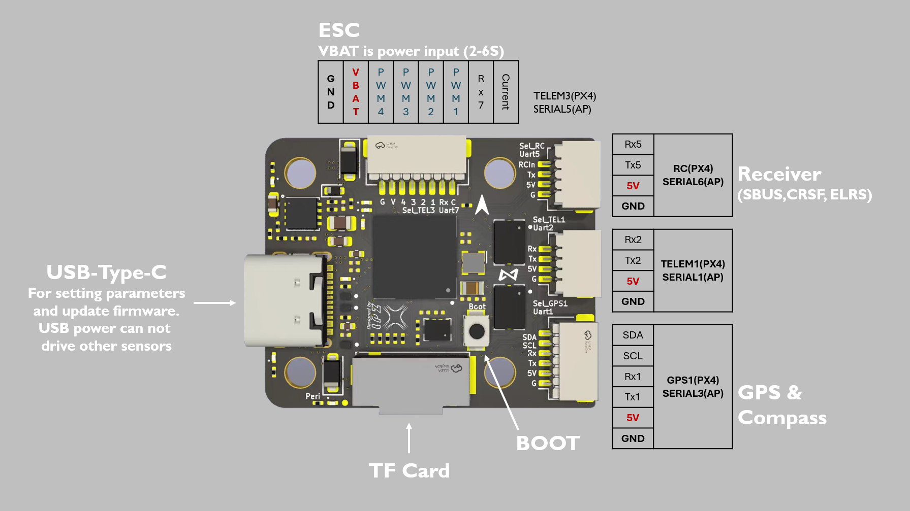

# Appendix
## Flight Controller

### Alternate Telemetry Port

If the TELEM2 port is broken, you can use the TELEM1 port instead. 

#### Hardware Changes

Plug the cable that is connected to the serial port on the Orin to the port labelled TEL1 on the flight controller. It is the middle connector on the right side of the board on the picture below:


#### Flight Controller Configuration Changes

On the parameter screen of QGroundControl, change `MAV_0_CONFIG` to TELEM 1.


Then, open the MAVLink console under "Analyze Tools", and run the following commands: 

``` 
param set SER_TEL1_BAUD 921600
cd fs/microsd
mkdir etc/
cd etc
echo "mavlink stream -d /dev/ttyS1 -s HIGHRES_IMU -r 1000" > extras.txt
```

!!! note
	The HKUST GitHub suggests that the correct port is /dev/ttyS2 for TELEM1, but /dev/ttyS1 is tested and works. An [issue](https://github.com/HKUST-Aerial-Robotics/Nxt-FC/issues/22) has been filed 

If you run `cat extras.txt`, the mavlink stream line should be present. 
