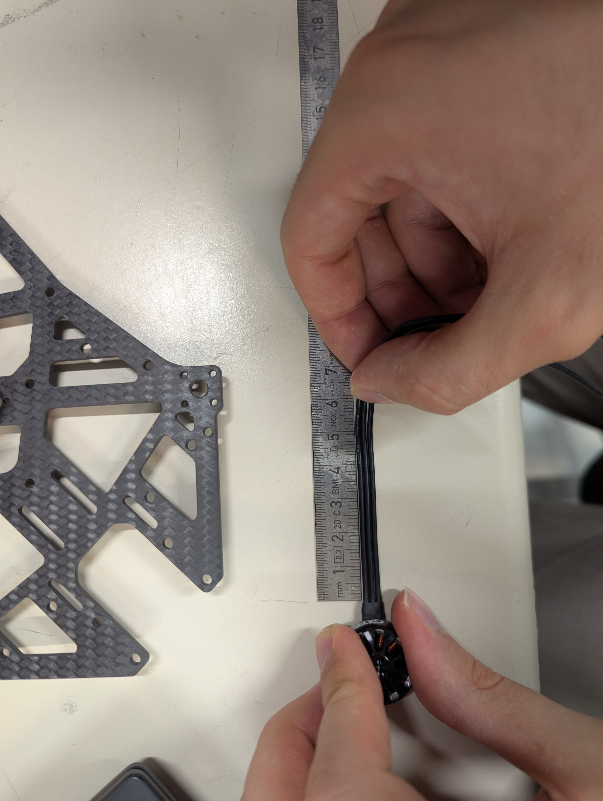
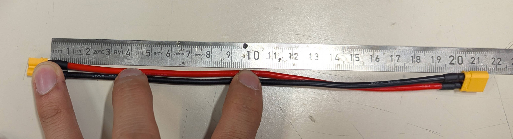
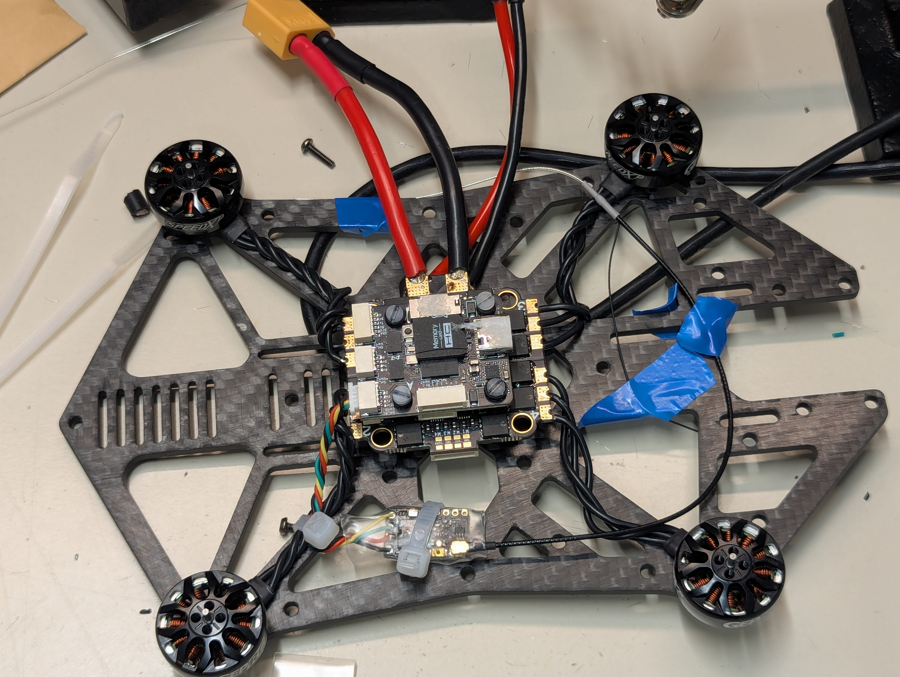
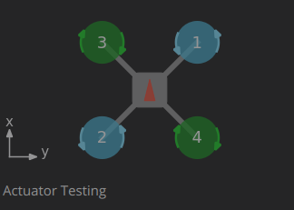
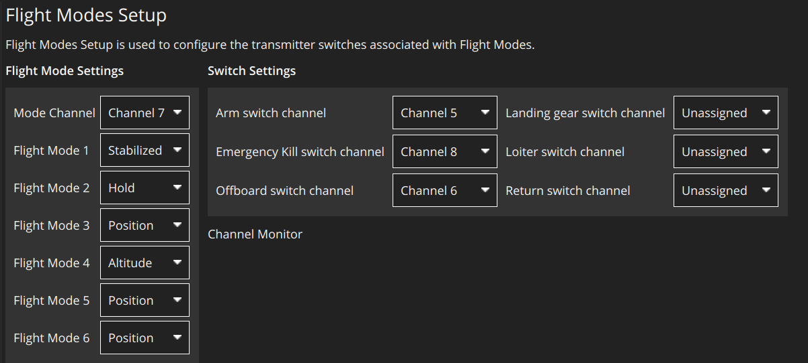

# Drone Setup

## Hardware Setup 

This section takes you through the hardware setup process for the OmniNXT Drone. The bill of materials can be found [here](https://docs.google.com/spreadsheets/d/1Fz7-T5uy2s32OVq4LXnWk0O-DXqRzYW_szNTOHq70fw/edit). 

3D print all of the necessary items that are labelled with the manufacturer "Self". 

Drone Naming: Establish a consistent naming scheme with the following requirements: 

- starts with a letter (requirement for hostnames)
- ends with a non-negative integer
- less than 32 characters in length (requirement for hostnames)
- only ascii lowercase alphanumeric characters
- no other numbers in the name except for the last characters

We use `nxt#` for our drones, where `#` is replaced with an integer

### Flight Controller and ESC

#### Soldering 

1. Insert the antivibration rubber pieces into the four holes of both the ESC and the flight controller. On the ESC, the shorter side should be on the side with the eight pin connection port.  On the flight controller, the shorter side of the rubber piece should be on the SD card side. 
2. Cut each of the motor wires to 55mm. Measure from the foot of the heatshrink.
3. Cut a orin power cable from the base of the male side: 
    1. 9.0cm on the red wire
    2. 8.5cm on the black wire
4. Take the XT60 Cable (CAB-004) and cut it to the following lengths: 
	1. Red: 8.5cm from the edge of the connector
	2. Black: 9.0cm from the edge of the connector 
5. Strip around 5mm from each wire of CAB-004 and add solder to each wire
6. Strip around 5mm from each wire of the orin power cable and add solder to each wire
7. Solder the red wires of CAB-004 and the orin power cable together on the positive pad of the ESC
8. Solder the black wires of CAB-004 and the orin power cable together on the negative pad of the ESC.
9. Visually inspect the solder joints to ensure no stray wires could cause a short between the pads. Use a digital multimeter in ohmmeter mode to measure the resistance between the + and - port of the ESC. The value should be >100kΩ.
9. Solder each of the motors to one triad of pins on the ESC. 
10. Use CAB-001 to connect the eight pin connectors on the flight controller and ESC. **Do not use the eight pin cable that comes with the flight controller**


!!! warning
    Be very careful to avoid shorts between pads, especially on the big + and - pads for the power. Even a single wire strand connecting is dangerous! Visually inspect the solder connections after soldering to be confident, as well as perform a multimeter check betwen the +/- pads. 
!!! note
    Ensure that each motor's wires are connected to three consecutive pads on the ESC, with one of them in the corner. It does not matter which motor wire goes on which pin other than this. 






#### Fastening Assembly to Frame

1. Stack the ESC and flight controller such that the big side of the rubber stoppers are touching. The MicroSD Card slot should be above the ESC power connection. 
2. Prepare the assembly: 
	1. With the flight controller on the bottom, insert two M2X25 bolts on the side with the USB-C port. The head of the bolt should be on the same side as the flight controller
	2. Insert two M2x20 bolts on the opposite side of the USB-C port. 
	3. Place the 6mm nylon spacers over all of the bolts. 
3. Orient the center of the frame over the assembly. The USB-C port should be facing towards the side if the frame with the cutout. The side with the divets for the nuts should be on the top. 
4. Loosely thread the M2 nuts onto each of the bolts 
5. For each of the bolts, hold the nut with your finger in the divet, and use a screwdriver to tighten the bolt. It should be snug, and equally tight across the four bolts. Do not overtighten, the ESC can contact the flight controller!
6. Fasten the motors to the frame with the shorter bolts that were included in the packaging. Ensure that the cables are close to the frame, you can twist them together to ensure this. 

### RC Receiver

1. Unpack the receiver and extract the following items: 
    - NanoRX PCB
    - Clear Heatshrink
    - Open ended antenna
2. Retrieve a 4 Pin JST Cable from the flight controller box
3. Cut the JST cable to a length of 5.5cm, from the base of the connector. 
4. Solder the four pin cable. Looking from the side with the antenna U.Fl Port towards you, and at the bottom. In order from the left pad to the right pad: 
    - GND (Black Wire\*)
    - 5V (Red Wire\*) 
    - FC RCIn (Green Wire\*)
    - FC TX (Yellow Wire\*)
5. Attach the antenna wire to the U.Fl Connector 
6. Cut 2cm of the clear heatshrink off and dispose of this length 
6. Put the rest of the clear heatshrink around the assembly and use a heatgun at 165℃ to protect the connections
7. Connect the RC receiver to the appropriate port on the flight controller. Use zipties to fasten the radio module and data cable to the frame. Take care not to ziptie over the binding button the RC Module. Tape the antenna down to the frame as shown.
   <!-- TODO: Insert picture -->

!!! note
    \*: The wire colours may not be reliable. Look at the silkscreen on the FC PCB to ensure the correct connection

!!! todo
    Put SBUS link and make the RC page visible

### Orin Connection 

1. Remove the protective film over the screw holes for the NVME SSD and the WiFi Adapters
1. Insert the NVME SSD to the corresponding port, and bolt it down with an M2x4 bolt. 
2. Attach the Wi-Fi antenna to the adapter. It does not matter which port goes into which antenna. [YouTube Video](https://youtu.be/8tzWKIt1v1E?t=40)
3. Insert the Wi-Fi adapter to the corresponding port, and bolt it down using an M2x4 bolt. 
5. Insert the CR1025 coin cell battery in the slot on the carrier board. The positive side faces away from the board.
4. Attach the carrier board and Orin to the other side of the frame as the flight controller.  Use 5mm nylon spacers between the carrier board and the frame, and M3x12 bolts from the side with the board. Before putting the nut on, put some Loctite 243 Threadlocker on the bolt so the assembly does not become unattached with vibrations 
5. Remove the orange covers off of the bolt holes on the carrier board.
6. Assemble the heatsink/fan onto the orin:
    1. Remove the fan from its protective casing, place it fan up to not smear the thermal paste
    2. Align the orin over the fan, using the bolt holes on the fan as a guide. If the edge connector is facing you, the holes on the fan to accomodate the inductors should be near you, and the fan wire should be on the left side.
    3. Bolt the frame down with the metal back. Use the provided bolts and screw them in with an X pattern using a T6 screwdriver bit 
6. Bolt the orin down to the carrier board with 2 M2x6 Nylon bolts.
7. Attach the fan cable to the orin carrier board 
7. Remove the protective film from the double sided tape on the Wi-Fi antenna, and attach it to the front (other side of the orin) of the drone. Take care not to cover the hole at the front of the frame. It will be over the motor bolts.  
8. Connect CAB-002 to the orin. It should go in the connector closest to the power connector on the long side of the carrier board. Route it between the orin and the frame and connect the other end to the flight controller port underneath the MicroSD card. 

### Frame Preparation 

1. Bolt (M3x8 Nylon) the five oddity RC standoffs at the marked locations in the image below. They should be protruding on the side with the flight controller. 

2. Put an M2x4 metal bolt in the marked slot below, protruding towards the orin. Use an M2 bolt to secure it. 

2. Bolt four M3 40mm standoffs with M3x10 nylon bolts. These should be on the Orin side.

3. Bolt the prop guard onto the Oddity RC standoffs with M3x12 metal bolts. 
5. Use a labelmaker to print the drone name on a label. Place it somewhere on the drone that is visible, such as one of the camera frame mounting posts (the aluminum M3 40mm standoffs)
!!! attention
	Do not install the propellers yet! They will be installed during the software setup section.  
### Optitrack Markers

If the optitrack system is used for odometry, five markers (MSC-008) must be placed on the drone. 

1. Identify the locations that you will place the five markers. The pattern they are in _must_ be: 
	1. assymmetric
	2. sufficiently unique compared to the other drones
2. For each marker, use hot glue to adhere it to the drone body.

### Camera Assembly

#### Cameras

For each of the cameras, perform the following tasks: 

##### Cable Preparation

1. Insert the camera cable into the camera. The side with the pads labelled FSIN and STROBE should be on the side of the camera. 
	1. Use a flathead screwdriver to pull out the retaining clip from the connector. 
	2. Insert the cable with the exposed contacts facing the PCB, push until it hits the back of the connector
	3. Secure the cable by pushing the retaining clip back in
2. Cut the microwire to a length of 30mm. 
3. Scratch around 4mm of coating off of both ends. The colour should change, and you can check with a magnifying glass or microscope. 
4. Apply some solder to both sides of the microwire
5. Solder one side of the microwire to the port labelled `F` on the camera board. The wire should come out on the opposite side of the camera.
6. Solder the other side to the pad lablled `FSIN` on the cable. 
7. Check the connection using the continuity mode between the `FSIN` and `F` pads.
8. Use the Kapton tape to secure the microwire, ensuring that the tape is providing strain relief for the solder connection

##### Lens Switch

1. Unscrew the lens that the camera ships with, and discard.
2. Unbolt the existing lens mount. 
3. Bolt the lens mount that came with the fisheye lens. 
4. Screw in the fisheye lens into the mount. 

##### Test and Focus

!!! note
	This step can be done anytime. However, it is suggested to test the camera setup now before things are bolted in more permanently. 

1. Insert all of the camera cables into the OAK camera board.
2. Plug in the OAK camera board via USB-C to a laptop computer with ROS installed
3. Download and install the driver package: [GitHub Repository](https://github.com/lis-epfl/oak_ffc_4p_driver_ros2) 
4. Check for focus on each of the cameras, and change the focus by turning the lenses on their holders. 
<!--5. If continuing in this order, disconnect the cameras from the OAK camera board.-->

#### Camera Mounts

!!! warning
	Be careful not to tug on the cables too much. They can tear.

1. Use a soldering iron at 215℃ to insert the M2 threaded inserts into the six holes of each camera mount
2. Bolt each camera to a mount by using four M2x8 bolts. The cables should be exiting towards the flange on the mount. 
3. Bolt the camera mounts to the camera holder frame. 

#### OAK Board

1. Connect the four camera cables to the OAK board. Ensure that the orientation of the board is as it would be in the final assembly, and do not allow any camera cable to be twisted. 
2. Put the two halves of the cover around the OAK board, and bolt the assembly to the frame with 4 M2x14 bolts. 
3. Put the camera frame on the metal standoffs above the orin, and bolt down with four M3x6 bolts.


## Flight Controller Setup

### Flashing Firmware

!!! important  
	Ensure you have fully run the host computer setup in the [IT Infrastructure Setup Guide](infra-setup.md)

#### Bootloader

1. Ensure the flight controller is powered off, unplug any power from the drone. 
2. While pressing the BOOT button beside the MicroSD card, connect the USB-C cable to the PC and release the boot button. 
3. Open the STM32CubeProgrammer by navigating to where it was installed in a terminal (`/usr/local/STMicroelectronics/STM32Cube/STM32CubeProgrammer/bin` by default), and running `sudo ./STM32CubeProgrammer`
4. On the blue dropdown next to the green connect button, select USB. 
5. Click the refresh button until a port is automatically selected under port. If it doesn't show up, ensure the board is in DFU mode by unplugging the USB-C cable, and holding the BOOT button while plugging it in again. 
6. Click Connect.
7. Open the menu on the left side and select "Erasing & Programming"
8. Under file path, click browse and find the bootloader bin file. It was built in the automatable dependencies playbook. It will be in `{host_fc_path}/PX4-Autopilot/build/hkust_nxt-dual_bootloader/hkust_nxt-dual_bootloader.bin` where `{host_fc_path}` is specified in the `ansible/group_vars/all`.
9. Check Verify programming, and Run after programming. Ensure the start address is `0x08000000`.
10. Click on Start Programming. 

#### Main Program

1. Navigate to `{host_fc_path}` in a terminal 
2. Open QGroundControl: `./QGroundControl.AppImage`. 
3. Click on the Q symbol on the top left, and click on vehicle setup. 
4. Click on the firmware tab, and unplug and replug the USB cable to the flight controller. 
5. A pop-up should come up named "Firmware Setup". Select PX4 Pro, and check advanced settings. Select "Custom firmware file..." and click Ok
6. In the file picker, navigate to `{host_fc_path}/PX4-Autopilot/build/hkust_nxt-dual_default` and select the `hkust_nxt-dual_default.px4` file. 
7. You should see tabs such as "Airframe" and "Sensors" once the flash is complete. 

### Apply Parameter File

!!! info
	If you do not have a parameter file or want to create a new one, you can follow the steps in the [Manual Setup > NXT Flight Controller Setup](manual-setup.md#nxt-flight-controller-setup) document instead of applying the parameter file as described below. 

First, ensure that the units in QGroundControl are set to SI Units: 

1. Click on the Q on the top left
2. Click on application settings
3. In the general tab under units, ensure that they are Meters, Meters, SquareMeters, Meters/second, Celsius. 

Then, apply the [saved parameter file](https://raw.githubusercontent.com/lis-epfl/swarm-nxt/refs/heads/main/docs/params/nxt_params.params) (which you can find in the swarm-nxt cloned repo: `swarm-nxt/docs/params/nxt_params.params`) by following the steps below: 

1. Click on the Q button on the top left, click on Vehicle Setup, and parameters. 
2. Click the tools button and select "Load from file". 
3. Select the parameter file that can be found on github.
4. Click okay to confirm 

### NXT Configuration and Calibration

#### MAV System ID and DDS Domain ID

The MAV System ID needs to be setup for every drone individually. This ID is a positive number that is associated with the drone. Follow a consistent naming scheme as described at the [top](#hardware-setup) of this document. Use the number that this drone ends with as your system ID. To set it:

1. Search for `MAV_SYS_ID` and `UXRCS_DDS_DOM_ID` in the parameters tab of QGroundControl's Vehicle Setup page.
2. Set them to the unique number of your drone.

!!! important   
    If this number is the same for two drones, things will **not** work and it will be very hard to debug. 

#### Propeller Numbering and Spin Direction

First make sure the power is connected to the ESC and the ESC is connected to the FC. No need to power the Orin at this point, so you can unplug the power cable from the orin before powering the ESC. Ensure that the photo under "Actuator Testing" looks correct: 



Under PWM MAIN, select DShot600 for MAIN 1-4. Click on "Identify & Assign Motors" and follow the process. For collision safety, ensure that the Onix is located closer to the rear rotors (rotors 2 and 4 in the image). 

!!! important
	The top of the quadroter is the side with the Orin. 

!!! important
	Ensure the propellers are unmounted before the next step

Set the spin direction for each motor so that it matches the image. Enable the slider, slide it  up a bit and ensure the rotation direction is correct. 

!!! important
	Manually verify the spin direction individually for each motor, since the spin direction may not match QGroundControl

#### Propeller Installation 

1. Observe the rotation direction in the propeller setup image. The Orin is on the back (near propeller \#2 and \#4). 
2. Using the long bolts that came with the propellers, bolt the propellers in. Verify that the propellers on the diagonals are the same type. Make sure that the blade orientation is in such a manner that as it turns in the rotor direction, it pushes the air down instead of up i.e. the air slides off of it downwards. 

   
   


#### Remote Control

Ensure the Taranis has been setup following the [Remote Control Setup Instructions](remote-control-setup.md). 

Go to the radio tab and follow the calibration procedure. 

Go to the flight modes page and set the channels like the image: 




#### Sensors

On the sensors tab: 

Click on the orientations sub-tab, and set the autopilot orientation to `ROTATION_ROLL_180_YAW_90`. Reboot if prompted.

!!! important
	This is true if the arrow on the flight controller is pointed to the right if looked at from the bottom (orin on the back)

Calibrate the gyroscope by putting the drone on a level surface, and then clicking the gyroscope button and following the wizard. 

Calibrate the accelometer by clicking on the accelerometer sub-tab and completing the procedure as prompted. 
 

## Software Setup

<!-- TODO: Add photo for recovery port, REC button, RES button --> 
1. Plug the external power into the XT60 cable for the battery.
2. Connect the host computer to the USB C port called "Recovery Port" on the carrier board. 
3. Provide the carrier board with an internet connection via an Ethernet dongle on one of the three host USB-C ports on the long side of the carrier board
4. Press the button labelled "RES" on the Devboard
5. While pressing the RES button, press the REC button
6. Release the RES button while still pressing the REC button
7. Release the REC button after the power is connected
8. On the host computer, run `lsusb`. This sequence was a success if an entry with NVIDIA Corp. APX is visible (`ID 0955:7323 NVIDIA Corp. APX`)
9. Run the sdkmanager: `sdkmanager --cli`
10. Login, and then select the following options: install -> jetson -> target hardware
11. Select Jetson Orin NX, it should already be pre-selected
12. Reply Y to showing all Jetson versions. Select JetPack 6.2.1
13. Select both additional SDKs
14. Do not customize install settings
15. Reply N to flashing the Jetson Orin NX Module
16. Accept the license, then press enter twice for the installation to start. 
17. Enter your password for administrative tasks.
18. It will install host components (on the PC) and target components. It will ask you whether to install or skip the installation on the Orin, choose skip.
19. Press enter to Exit.


### Flashing Process 

After the host components of the SDK are installed, run the following steps: 

1. Open the `~/nvidia/nvidia_sdk/JetPack_6.2_Linux_JETSON_ORIN_NX_TARGETS/Linux_for_Tegra` folder. Open a terminal in this folder. 
2. Download the post-install image from the [Google Drive](https://drive.google.com/drive/folders/1IpKJmJZyAb2P-46V7JcgBnGyn-WECAMc). Run the following command: `tar -xvf /path/to/post-install_image.tar.gz -C ~/nvidia/nvidia_sdk/JetPack_6.2_Linux_JETSON_ORIN_NX_TARGETS/Linux_for_Tegra/tools/backup_restore`. This will take a while.
3. Once this is done, make sure that the Orin is still in recovery mode (step 8 of [Software Setup](#software-setup)), and run this command to flash the Jetson: `sudo ./tools/backup_restore/l4t_backup_restore.sh -e nvme0n1 -r jetson-orin-nano-devkit-nvme`. This will also take a while.
4. Press the button labelled RES on the Jetson once the command has completed. 

!!! important
    Ensure you are in the `Linux_for_Tegra` folder

### Post-Flash Setup

On the host computer, you should be able to SSH into the Orin now: `ssh lis@192.168.55.1`. This connection is provided through the USB Recovery port. These are the default credentials: 

```
username: lis
password: orin
```

#### Password-Free Access

For password free access to the Orin, follow these steps: 

1. Ensure that you have an SSH key in ~/.ssh
    1. If not, run `ssh-keygen -t ed25519 -C <yourCommentHere>`
2. With the USB connected, run `ssh-copy-id lis@192.168.55.1`
3. Make sure that the ssh-agent is on: ``eval `ssh-agent` `` 
4. Add your key to the agent: `ssh-add`
5. Ensure that you can access the device without a password: `ssh lis@192.168.55.1`


#### Ansible 

On the host computer, navigate to the `ansible/` directory of the omni-nxt repo and run the playbook: 

``ansible-playbook -i inventory.ini drone_setup.yml -K``

Enter the sudo password of the orin when prompted, as well as the hostname which should end with the same number that you set `MAV_SYS_ID` to in [NXT Configuration and Calibration](#nxt-configuration-and-calibration). 

!!! important
    It is very important that you set a unique hostname. You must follow the structured naming pattern described at the top of this document. The software depends on this assumption.

Then install the packages with: 

``ansible-playbook -i inventory.ini drones_update.yml``

#### Connecting to QGC

In QGC go to Application Settings, MAVLink, then make sure enable MAVLink forwarding is unchecked. 
The DDS uses TELEM2 for communication with the FC, so we need to use the USB-C connection to communicate via MAVLINK. For this ssh into the drone and run:

``mavproxy.py --master="/dev/ttyACM0" --baudrate 115200 --out="udp:<ipofhost>:14550"``

!!! important
    Sometimes you need to connect at `/dev/ttyACM1` instead of `/dev/ttyACM0` especially after rebooting the FC.

## Vision Setup
### Enable Vision in Ansible

To launch the vision drivers and mapping nodes, set the `enable_vision` flag in your Ansible configuration.

#### **Option A: Enable for All Drones**

Edit `ansible/group_vars/all`:

```yaml
enable_vision: true
```

#### **Option B: Enable for Specific Drones**

Edit `ansible/inventory.ini`:

```ini
[drones]
nxt1.local enable_vision=true
nxt2.local  # Vision disabled
```

---

### Camera Calibration

We use the **Quadcam Calibration Tool** to generate rectification maps for the depth estimation node.

#### **Install the Tool**
Ensure you have run the `host_computer.yml` playbook to install the calibration tool on your system. It will be in `~/data/repos/quadcam_calibration_tool`.

#### **Perform Calibration**
Follow the instructions in the Quadcam Calibration Tool README to collect data and generate the rectification maps.

#### **Deploy Maps**

Copy the output folder to the drone:

```bash
# Example: Deploying maps for 192x192 resolution to nxt1
scp -r final_maps lis@nxt1.local:/home/lis/ros2_ws/src/depth_estimation_ros2/config/final_maps_192_192
```

#### **Configure the Drone**

SSH into the drone and edit:

```
~/ros2_ws/src/depth_estimation_ros2/config/depth_omninxt_params.yml
```

Modify the values if necessary: `calibration_resolution: 192_192` and the `onnx_model_path: "/home/lis/ros2_ws/src/depth_estimation_ros2/models/S2M2_S_192_192_v2_torch29.onnx"`.

## Flight Preparation 

### PID Tuning

1. Follow all the steps in the [Pre-Flight Checklist](flying.md#pre-flight-checklist)
2. Launch the vehicle in position mode, and fly it slowly. Make sure that it feels decently well to operate. 
3. Hover the drone at 1.5 m, and ensure that it the drone is in the center of a 2x2x2m cube of free space. 
4. In QGroundControl, click on the Q on the top left and open the vehicle setup menu
5. Click on PID Tuning
6. Enable autotune
7. Autotune the rate controller. 
8. Land, and save the parameters
9. Takeoff again in a safety volume of 2x2x2m. 
10. Autotune the attitude controller.
11. Land. 

If the autotune fails, you can increase the `MC_AT_SYSID_AMP` parameter by steps of 0.5, and trigger the autotune again. 

### Optitrack Setup 

1. Bring the drone into view of the OptiTrack sensors
2. Place the drone in view of the OptiTrack cameras, and ensure that the drone is facing the positive x direction of the coordinate system. 
3. Select the drone's markers on the screen, right click, and click on create rigid body. Give each drone the same name as the hostname. This allows the automated tooling to work properly.

!!! warning
	It is very important that the drone is facing the positive x direction (orin towards the negative x direction). It is also important that the Optitrack streams at 120Hz and not 240Hz (otherwise ROS2 would have performance issue).


