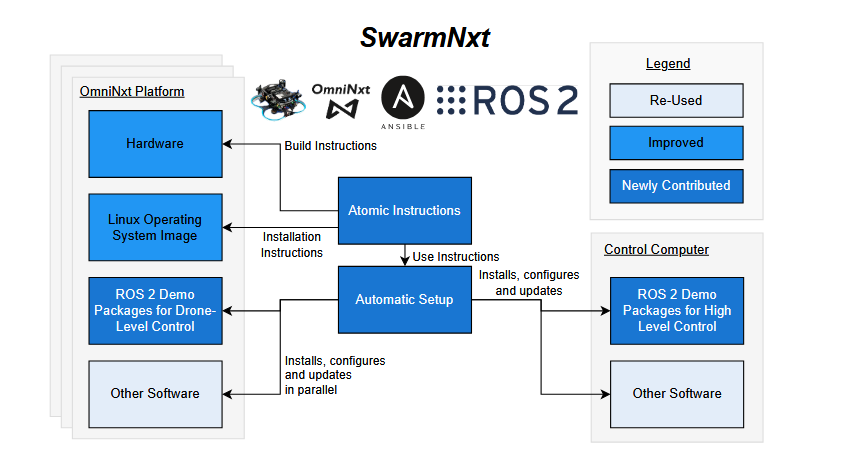

# SwarmNxt

A system to setup and manage drones for swarming research, with [OmniNxt](https://github.com/HKUST-Aerial-Robotics/OmniNxt) hardware (Liu et. al.). The hardware and software setup tutorial can be found here [https://lis-epfl.github.io/swarm-nxt/](https://lis-epfl.github.io/swarm-nxt/).

The full video can be watched at [https://youtu.be/9aOr5EDLQEo](https://youtu.be/9aOr5EDLQEo).

